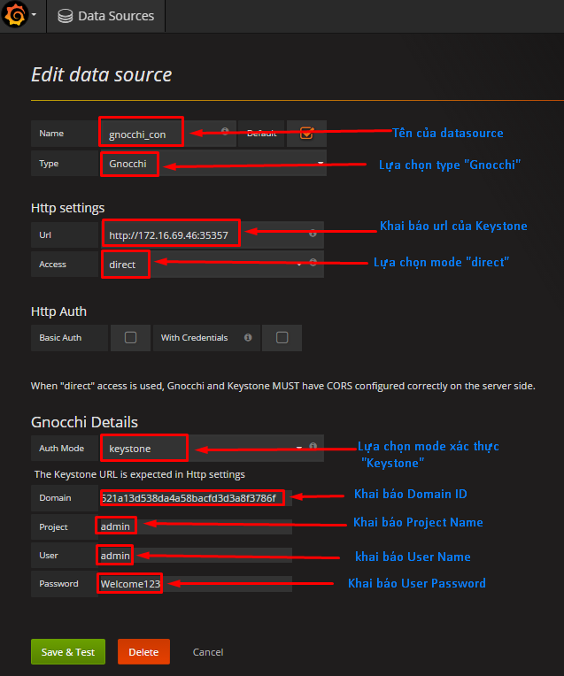
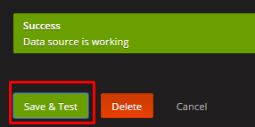
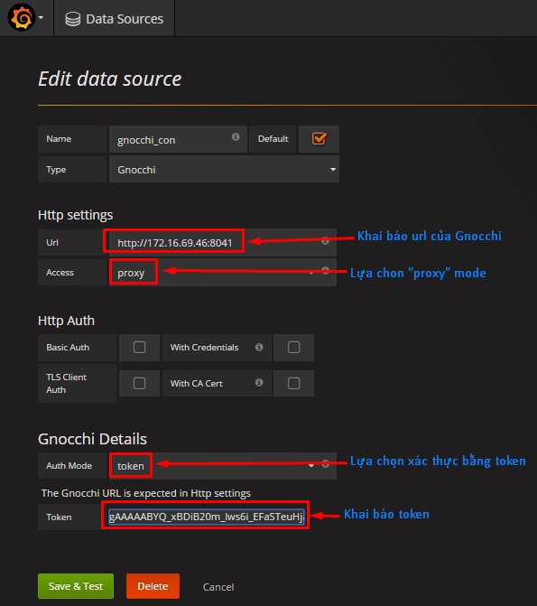
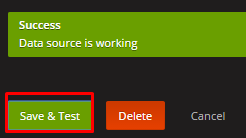

# Cấu hình Grafana lấy metric từ Gnocchi
## 1. Cấu hình Grafana
### 1.1. Cài đặt Grafana (hiện đang chạy bản 4.0)
```
echo "deb https://packagecloud.io/grafana/stable/debian/ wheezy main" >> /etc/apt/sources.list

curl https://packagecloud.io/gpg.key | sudo apt-key add -

sudo apt-get update
sudo apt-get -y install grafana
```

### 1.2. Cấu hình tài khoản admin cho Grafana
```
vim /etc/grafana/grafana.ini

[security]
admin_user = admin
admin_password = admin
```

### 1.3. Cài đặt Gnocchi Datasource
```
grafana-cli plugins install sileht-gnocchi-datasource
```

### 1.4. Khởi động lại dịch vụ
```
service grafana-server restart
```

## 2. Trên node Gnocchi 
### 2.1. Cấu hình cors cho Gnocchi
```
vim /etc/gnocchi/gnocchi.conf
...
[api]
middlewares = oslo_middleware.cors.CORS
middlewares = keystonemiddleware.auth_token.AuthProtocol

[archive_policy]
[cors]
allowed_origin = http://172.16.69.150:3000
expose_headers = X-Auth-Token,X-Openstack-Request-Id,X-Subject-Token
allow_methods = GET,PUT,POST,DELETE,PATCH
allow_headers = X-Auth-Token,X-Openstack-Request-Id,X-Subject-Token,X-Project-Id,X-Project-Name,X-Project-Domain-Id,X-Project-Domain-Name,X-Domain-Id,X-Domain-Name

```

### 2.2. Cấu hình cors cho api-paste.ini
```
vim /etc/gnocchi/api-paste.ini
[filter:cors]
paste.filter_factory = oslo_middleware.cors:filter_factory
oslo_config_project = gnocchi
allowed_origin = http://172.16.69.150:3000
```

### 2.3. Khởi động lại dịch vụ
```
cd /etc/init/; for i in $(ls gnocchi-* | cut -d \. -f 1 | xargs); do sudo service $i restart; done
```

## 3. Trên node Keystone 
### 3.1. Cấu hình cors cho Keystone
```
vim /etc/keystone/keystone.conf
...
[cors]

allowed_origin = http://172.16.69.150:3000
expose_headers = X-Auth-Token,X-Openstack-Request-Id,X-Subject-Token
allow_methods = GET,PUT,POST,DELETE,PATCH
allow_headers = X-Auth-Token,X-Openstack-Request-Id,X-Subject-Token,X-Project-Id,X-Project-Name,X-Project-Domain-Id,X-Project-Domain-Name,X-Domain-Id,X-Domain-Name
```

### 3.2 Cấu hình cors cho keystone-paste.ini
```
[filter:cors]
use = egg:oslo.middleware#cors
oslo_config_project = keystone
allowed_origin = http://172.16.69.150:3000
```

### 3.3. Khởi động lại dịch vụ
```
service keystone restart
```

## 4. Cấu hình Datasource trên Grafana
### 4.1. Các mode access vào Gnocchi
**proxy**: ở mode này, Grafana sẽ nhận request từ user, và chuyển tới Gnocchi. Grafana sẽ chỉ xác thực được với Gnocchi qua token được cung cấp sẵn, khi token hết hạn sẽ phải cấp lại, hoặc lựa chọn không xác thực Gnocchi với Keystone (kém bảo mật).

**direct**: ở mode này, user sẽ làm việc trực tiếp với Gnocchi, Grafana chỉ đóng vai trò hiển thi. User sẽ xác thực với Keystone định kỳ, do đó bảo mật được thông tin.

### 4.2. Cấu hình Datasource
#### Cấu hình các thông số cho direct mode



#### Kiểm tra kết nối



#### Cấu hình các thông số cho proxy mode



#### Kiểm tra kết nối


