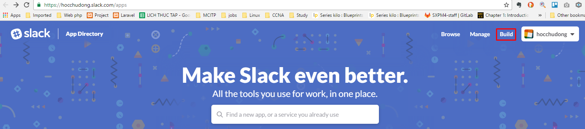
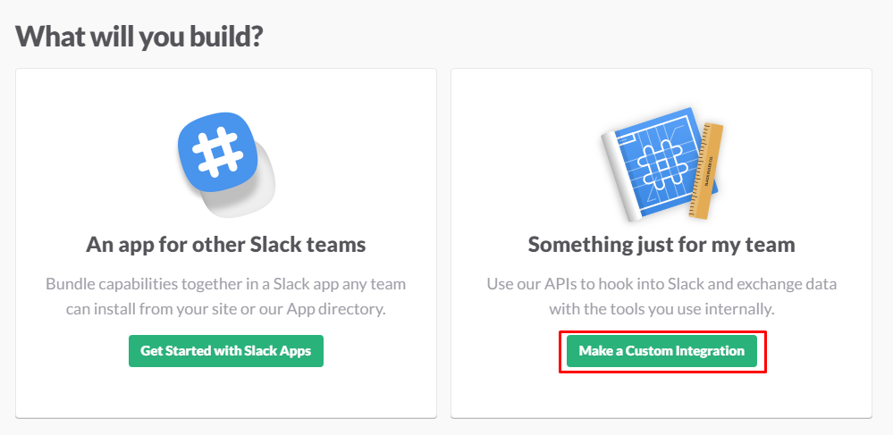
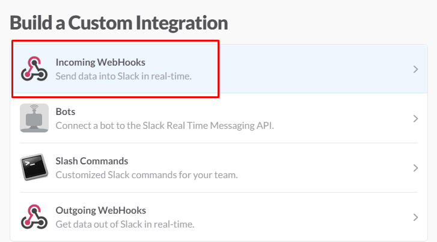
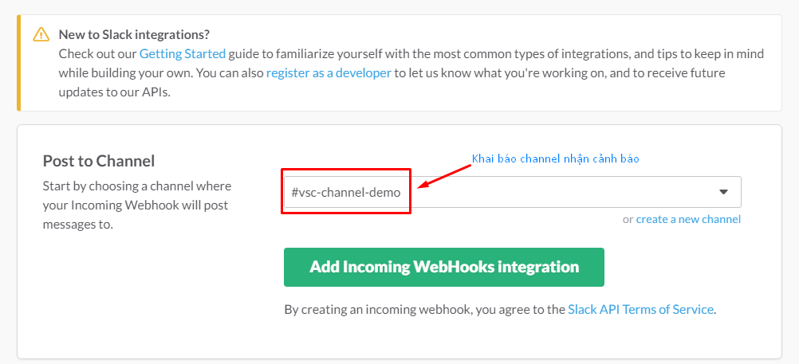
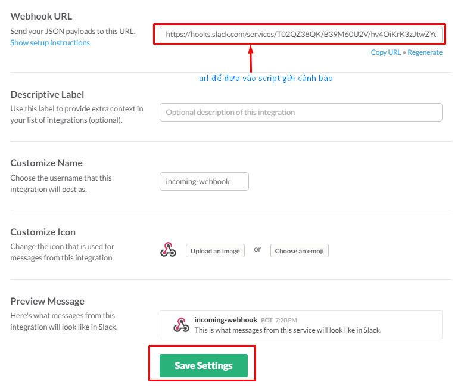

# Cấu hình cảnh báo một event AODH theo dõi và gửi tới Slack
AODH hỗ trợ gửi cảnh báo thông qua `http`, `log` và `zaqar`. Hai thành phần tính toán việc gửi cảnh báo là:
 - `aodh-evaluator`: định kỳ sẽ tương tác với Gnocchi API hoặc Ceilometer API (mặc định 1 giây) để lấy các thông tin về các metric, đánh giá các metric đó đã tới ngưỡng hay chưa để gửi cảnh báo.
 - `aodh-listener`: lắng nghe trên rabbit queue để phát hiện các event đã được định nghĩa chưa, nếu chúng xuất hiện sẽ gửi cảnh báo.

Tài liệu này sẽ hướng dẫn việc gửi cảnh báo từ aodh sử dụng `http`, thông qua một web proxy để gửi cảnh báo tới Slack (hoặc email). Các event sẽ được cảnh báo:
 - Các sự kiện liên quan đến VM (create,delete, resize, rebuild, migrate,...)
 - Các sự kiện liên quan đến volume (create,delete, resize, attach, detach, migrate,...)
 - Bandwidth VM vào, ra vượt quá ngưỡng quy định
 - CPU VM vượt quá ngưỡng quy định
 - Memory VM vượt quá ngưỡng quy định

## 1. Trên node Ceilometer
### 1.1. Tạo cảnh báo với các sự kiện của VM
```
ceilometer alarm-event-create --name event_vm --alarm-action 'log://' --repeat-actions True --event-type compute.instance.* 
```

### 1.2. Tạo cảnh báo với các sự kiện của volume
```
ceilometer alarm-event-create --name event_volume --alarm-action 'http://localhost:5123/volume' --repeat-actions True --event-type volume.* 
```

### 1.3. Tạo cảnh báo khi bandwidth của VM đạt ngưỡng
```
ceilometer alarm-threshold-create --name in_bandwidth --description 'bandwidth incoming'  \
      --meter-name network.incoming.bytes.rate  --threshold 0.01 --comparison-operator gt  --statistic avg \
      --period 60 --evaluation-periods 1 \
      --alarm-action 'http://localhost:5123/bandwidth' --repeat-actions True' \
```


### 1.2. Cài đặt flask và tải script
```
pip install flask
mkdir flask
cd flask
wget https://git.cloudvnpt.com/longlq/Ceilometer/raw/master/scripts/alarm_proxy.py
chmod +x alarm_proxy.py
```

### 1.3. Khởi chạy flaskapp
```
export FLASK_APP=flask/alarm_proxy.py
flask run --host=0.0.0.0 --port=5123
```

### 1.4. Cấu hình để scipt tự động khởi chạy
```
ln alarm_proxy.py /etc/init.d/alarm_proxy.py
chmod 770 /etc/init.d/alarm_proxy.py
update-rc.d alarm_proxy.py defaults
/etc/init.d/alarm_proxy.py start
```

## 2. Cấu hình Slack
*Lưu ý: Tài khoản cấu hình phải có quyền Owner trên team nhận alarm*











Tham khảo:

[1]- https://www.rdoproject.org/install/ceilometerquickstart/
[2]- https://01.org/openstack/blogs/cabuerger/2015/aodh-alarm-events-openstack
[3]- https://www.rdoproject.org/testday/tests/ceilometer/h/alarmthresholdevaluation/